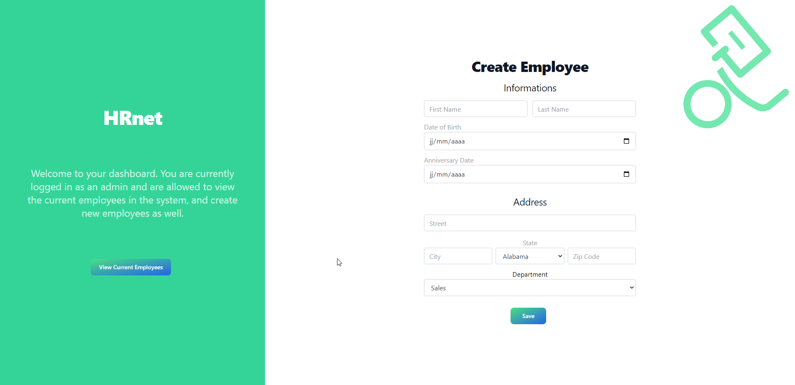

# HRNet

## Description

This project is a React application that allows users to add new employees to a data table using react components and redux. The goal was to adapt some Jquery libraries to a React application.

## Table of Contents

- [HRNet](#hrnet)
  - [Description](#description)
  - [Table of Contents](#table-of-contents)
  - [Features](#features)
  - [Demo](#demo)
  - [Installation](#installation)
  - [Usage](#usage)

## Features

- [Feature 1]: Add an employee to the table using a form.
- [Feature 2]: View all employees in the table.

## Demo



## Installation

To install and run this project locally, follow these steps:

1. Clone the repository: `git clone [repository URL]`
2. Navigate to the project directory: `cd project-react`
3. Install the dependencies: `npm install`

## Usage

To start the development server and run the application, use the following command:
````
npm start